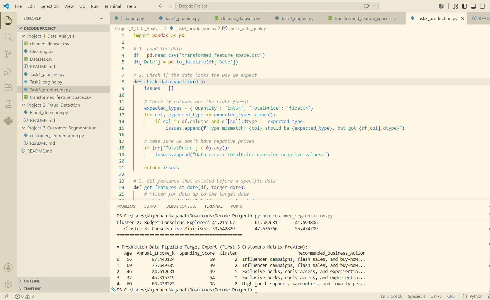

# Project 1: Advanced EDA & Feature Engineering Pipeline

## Project Mission: Real-Numbered Coordinate Optimisation
Following the DecodeLabs philosophy, this project rejects the idea of machine learning as qualitative reasoning. Instead, it treats data preprocessing as the structural engineering of mathematical truth, refining raw, chaotic variables into high-fidelity real-numbered coordinate spaces.

## Pipeline Architecture & Tasks Breakdown
This project is modularly split across 4 production scripts to handle the ingestion, transformation, and validation layers:

### 1. Data Cleaning & Input Fidelity
- **The Missing Data Decision Matrix:** Implemented rules-based logic to handle missing values depending on thresholds (<5% dropped; 5%-20% global median or group-wise imputation; >20% KNN Imputation).
- **Outlier Neutralisation (Winsorisation):** Isolated anomalies using the Interquartile Range (IQR) formula boundaries and capped extreme values utilizing `numpy.clip()` to preserve sequential row integrity.

### 2. Vectorised Computation Engine
- **Zero Procedural Loops Constraint:** Eliminated standard Python dynamic loop bottlenecks ($O(N)$ overhead) in favor of compiled, C-level SIMD operations via NumPy and Pandas vectorisation.
- **Categorical Coordinate Mapping:** Replaced spatial-bias-inducing Label Encoding with One-Hot Encoding (OHE) to map nominal classes into equidistant orthogonal coordinate axes ($\sqrt{2}$ geometric neutrality).
- **Collinearity Eradication:** Calculated an absolute Pearson correlation matrix to isolate highly correlated feature pairs ($>0.80$). Systematically dropped the feature with weaker correlation to the target variable $y$ to prevent matrix singularity.
- **Feature Space Expansion:** Engineered exactly 3 new predictive features, mathematically expanding the coordinate space with fully documented domain justification.

### 3. Production Contracts & Feature Serving
- **Runtime Validation:** Implemented `Pandera` structural data contracts using `@pa.check_io` decorators with `lazy=True` activated to generate comprehensive failure logs without interrupting pipeline execution.
- **Centralised Serving Layer:** Configured a `Feast` feature store framework with a dual-store architecture (Offline for batch training/Online for real-time lookups) enforcing point-in-time correctness to prevent data leakage.

## Tech Stack
- **Language:** Python
- **Core Libraries:** Pandas, NumPy, Pandera, Feast, Matplotlib, Seaborn

## 📸 Screenshots

